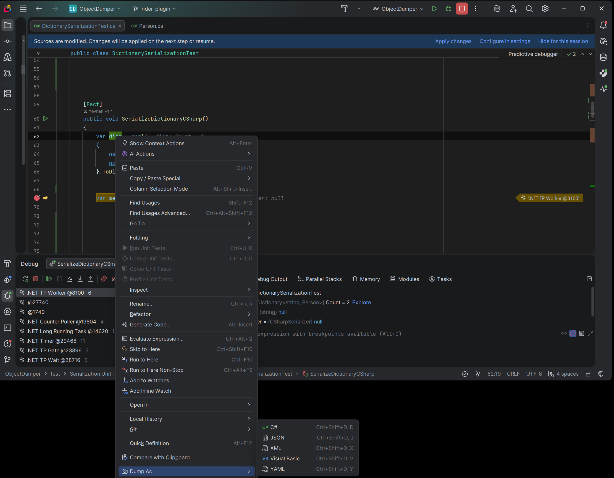
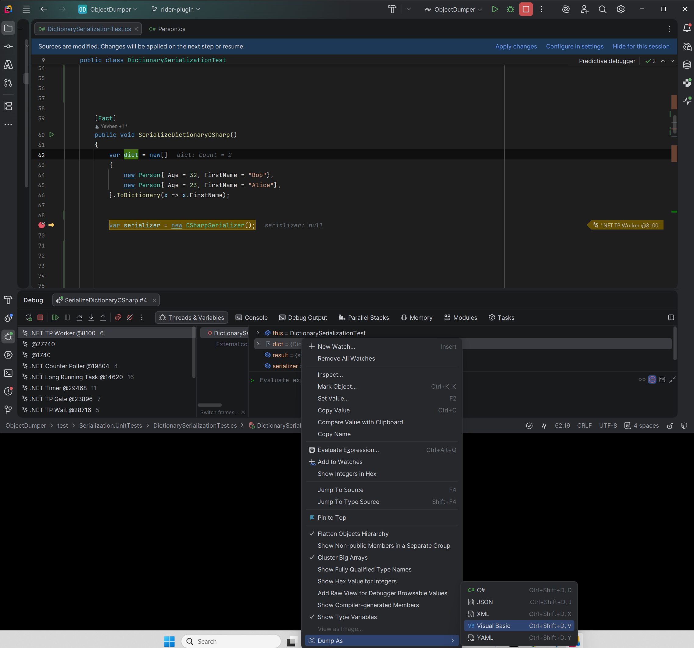

# Object Dumper for JetBrains Rider

[](https://plugins.jetbrains.com/plugin/30257-object-dumper)
[](https://github.com/ycherkes/ObjectDumper)
[](../../LICENSE.txt)

[](https://stand-with-ukraine.pp.ua)

## Terms of use[?](https://github.com/Tyrrrz/.github/blob/master/docs/why-so-political.md)

By using this project or its source code, for any purpose and in any shape or form, you grant your **implicit agreement** to all the following statements:

- You **condemn Russia and its military aggression against Ukraine**
- You **recognize that Russia is an occupant that unlawfully invaded a sovereign state**
- You **support Ukraine's territorial integrity, including its claims over temporarily occupied territories of Crimea and Donbas**
- You **reject false narratives perpetuated by Russian state propaganda**

To learn more about the war and how you can help, [click here](https://stand-with-ukraine.pp.ua). Glory to Ukraine! 🇺🇦

---

**Object Dumper** is a JetBrains Rider plugin for exporting live objects from the debugger into reusable **C#**, **Visual Basic**, **JSON**, **XML**, or **YAML** representations.

Instead of manually expanding a large object graph and copying values one by one, pause at a breakpoint, right-click a variable, choose **Dump As**, and send the generated output to a new editor tab, the clipboard, or the debug console.

This is the [JetBrains Rider version](https://plugins.jetbrains.com/plugin/30257-object-dumper) of [Object Dumper](https://github.com/ycherkes/ObjectDumper), also available for Visual Studio and Visual Studio Code.

## Features

### Dump debugger objects in multiple formats

- C# object initialization code
- Visual Basic object initialization code
- JSON
- XML
- YAML

### Generate code you can reuse

C# and Visual Basic dumps are powered by [VarDump](https://github.com/ycherkes/VarDump) and are intended to produce readable code that can be copied into tests, samples, repro cases, or debugging utilities. See the [VarDump documentation](https://github.com/ycherkes/VarDump#readme) for supported formatting and traversal options.

Typical uses include:

- creating test fixtures from runtime objects
- capturing complex DTOs for bug reports or reproductions
- converting live debugger state to JSON or YAML
- generating C# or Visual Basic object initialization code
- inspecting large object graphs without expanding every debugger node manually

### Choose where dumps go

Generated output can be sent to:

- **New Tab**
- **Clipboard**
- **Debug Console**

Serialization, traversal, formatting, and output behavior can be configured under **Settings / Preferences → Tools → Object Dumper**.

## Installation

### JetBrains Marketplace

Install [Object Dumper from the JetBrains Marketplace](https://plugins.jetbrains.com/plugin/30257-object-dumper), or directly from Rider:

1. Open **Settings / Preferences**
2. Go to **Plugins**
3. Search for **Object Dumper**
4. Click **Install**
5. Restart Rider if prompted

### Install a locally built plugin

1. Build the plugin as described in [Building from source](#building-from-source).
2. Open **Settings / Preferences → Plugins** in Rider.
3. Open the plugin actions menu.
4. Choose **Install Plugin from Disk...**
5. Select the generated ZIP from:

   ```text
   build/distributions/ObjectDumper-*.zip
   ```

## Usage

1. Start debugging a .NET application in Rider.
2. Stop at a breakpoint.
3. Locate the object or variable in the **Debug** tool window.
4. Right-click it and choose **Dump As**.
5. Select C#, Visual Basic, JSON, XML, or YAML.
6. Object Dumper serializes the object and writes the result to the configured destination.




## Configuration

Configure dump behavior under:

**Settings / Preferences → Tools → Object Dumper**

The settings are grouped into tabs for:

- Common
- C#
- Visual Basic
- JSON
- XML
- YAML

### Common settings

| Option | Description | Default |
|---|---|---|
| **Max Depth** | Maximum object-graph traversal depth | `25` |
| **Operation Timeout** | Maximum debugger dump duration | `10 seconds` |
| **Dump To** | Output destination | `New Tab` |

C# and Visual Basic settings correspond to VarDump options. Rider displays their defaults; refer to the [VarDump documentation](https://github.com/ycherkes/VarDump#readme) for serializer behavior.

## Changelog

See the [project changelog](https://github.com/ycherkes/ObjectDumper/blob/main/CHANGELOG.md) for release details and migration guidance.

## Requirements

- JetBrains Rider 2023.3 or later
- A supported local .NET debugging session
- C#, F#, or Visual Basic .NET project

Supported serializer targets include:

- .NET Framework 4.5+
- .NET Standard 2.0+
- .NET Core 2.0+
- .NET 5+

## Known limitations

- Remote debugging is currently not supported.
- Optimized Release builds may expose fewer values or produce debugger evaluation errors.
- Debugger evaluation is subject to Rider and runtime restrictions.
- Raw C# string literals and collection expressions require a compatible C# language version in the code that consumes the generated output.

## Building from source

### Prerequisites

- **JDK 17**
- Gradle wrapper included in the repository

> [!IMPORTANT]
> Rider plugin packaging currently requires JDK 17 for this project. JDK 21 alone is not sufficient for the current build setup.

From the Rider plugin directory:

```bash
cd src/ObjectDumper.Rider
./gradlew buildPlugin -x instrumentCode
```

On Windows:

```powershell
cd src/ObjectDumper.Rider
.\gradlew.bat buildPlugin -x instrumentCode
```

The plugin is Kotlin-only and does not use Java GUI forms, so code instrumentation is not required. Excluding `instrumentCode` also avoids a known IntelliJ Platform Gradle Plugin `2.0.0` failure on some Windows/JDK installations.

The packaged plugin is written to:

```text
build/distributions/
```

### Run Rider in a development sandbox

```bash
./gradlew runIde
```

On Windows:

```powershell
.\gradlew.bat runIde
```

## Architecture

Object Dumper separates Rider integration from the shared serialization layer:

1. **Rider plugin layer:** Provides actions, settings, context menus, and IDE integration.

2. **Debugger integration:** Evaluates the selected expression in the active Rider debugging session.

3. **Shared serialization layer:** Uses framework-specific `YellowFlavor.Serialization.dll` assemblies and VarDump 2.x for C#/Visual Basic output.

4. **Output handling:** Sends generated content to an editor tab, clipboard, or debug console.

The Rider package contains serializer assemblies for multiple .NET target frameworks so the plugin can inject a compatible serializer into the debuggee.

## Powered by

| Library | Purpose | License |
|---|---|---|
| [VarDump](https://github.com/ycherkes/VarDump) | C# and Visual Basic object serialization | [Apache-2.0](https://github.com/ycherkes/VarDump/blob/main/LICENSE) |
| [Json.NET](https://github.com/JamesNK/Newtonsoft.Json) | JSON and XML serialization | [MIT](https://github.com/JamesNK/Newtonsoft.Json/blob/master/LICENSE.md) |
| [YamlDotNet](https://github.com/aaubry/YamlDotNet) | YAML serialization | [MIT](https://github.com/aaubry/YamlDotNet/blob/master/LICENSE.txt) |
| [ILRepack](https://github.com/gluck/il-repack) | Serializer assembly merging | [Apache-2.0](https://github.com/gluck/il-repack/blob/master/LICENSE) |

## Contributing

Contributions, bug reports, and feature requests are welcome.

- [Open an issue](https://github.com/ycherkes/ObjectDumper/issues/new/choose)
- [Submit a pull request](https://github.com/ycherkes/ObjectDumper/compare)
- Star the [Object Dumper repository](https://github.com/ycherkes/ObjectDumper)

## Privacy

**Object Dumper does not collect personal data.**

Debugger interaction and serialization happen locally as part of the Rider debugging session.

## Support the project

If Object Dumper saves you time, you can support its continued development:

- [GitHub Sponsors](https://github.com/sponsors/ycherkes)
- [PayPal](https://www.paypal.com/donate/?business=KXGF7CMW8Y8WJ)

A big thank you to [Yova Solutions](https://www.yovasolutions.com) for sponsoring this work.

## License

Object Dumper is licensed under the [MIT License](../../LICENSE.txt).
